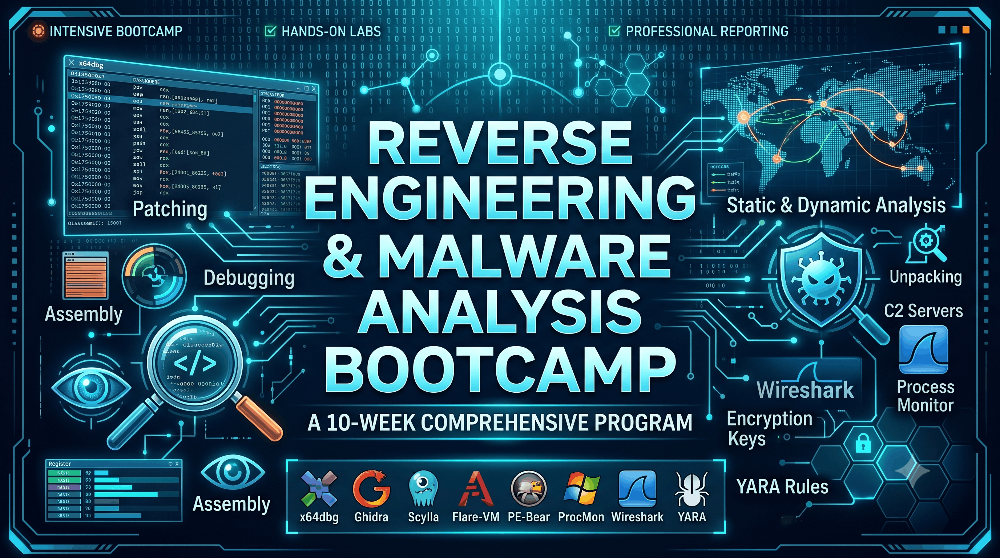

# Welcome Reverse Engineering & Malware Analysis | Herald College Kathmandu

*generated by gemini

# Course Description

This 10-week intensive course combines two critical cybersecurity disciplines: **Reverse Engineering (RE)** and **Malware Analysis (MA)**. Students will learn to analyze, debug, unpack, and understand malicious software using industry-standard free tools including x64dbg, Ghidra, Scylla, and the Flare-VM toolkit.

The course is structured as two 2-hour workshops per week – one focused on reverse engineering fundamentals and one focused on malware analysis techniques. By the end of the program, students will be able to manually unpack custom-packed malware, extract indicators of compromise (IOCs), write YARA rules, and produce professional malware analysis reports.

## Course Details

* **Total Contact Hours:** 40
* **Prerequisites:** Basic Windows familiarity, ability to install software on a virtual machine
* **Lab Environment:** Flare-VM (Windows 10/11 guest on Oracle VirtualBox)

> 💡 *Note: All Tools Used Are Free and Open Source*

## What You Will Learn

By the end of this course, you will be able to:

* Navigate and use **x64dbg** debugger proficiently
* Patch and modify executable behavior without source code
* Understand PE file structure and Windows internals
* Perform static analysis to identify packers and suspicious imports
* Conduct dynamic analysis using **ProcMon**, **RegShot**, and **Wireshark**
* Identify standard packers (UPX, ASPack) and custom packers
* Manually unpack packed malware and dump memory
* Fix Import Address Tables (IAT) and section alignments
* Use **Ghidra** for deep static analysis of unpacked malware
* Extract C2 servers, encryption keys, and persistence mechanisms
* Write YARA rules for malware detection
* Produce a professional malware analysis report

## Course Instructor

Mr. Aatiz Ghimire (Lead Instructor)

Siman Giri
(Course Consultant)

## Register for the Course
You will be notified via email from the PAT office or College Administration once registration begins.

After registration opens, you will be able to enroll by clicking the registration button on this page or using the link that will be shared.

[Register Here](#)